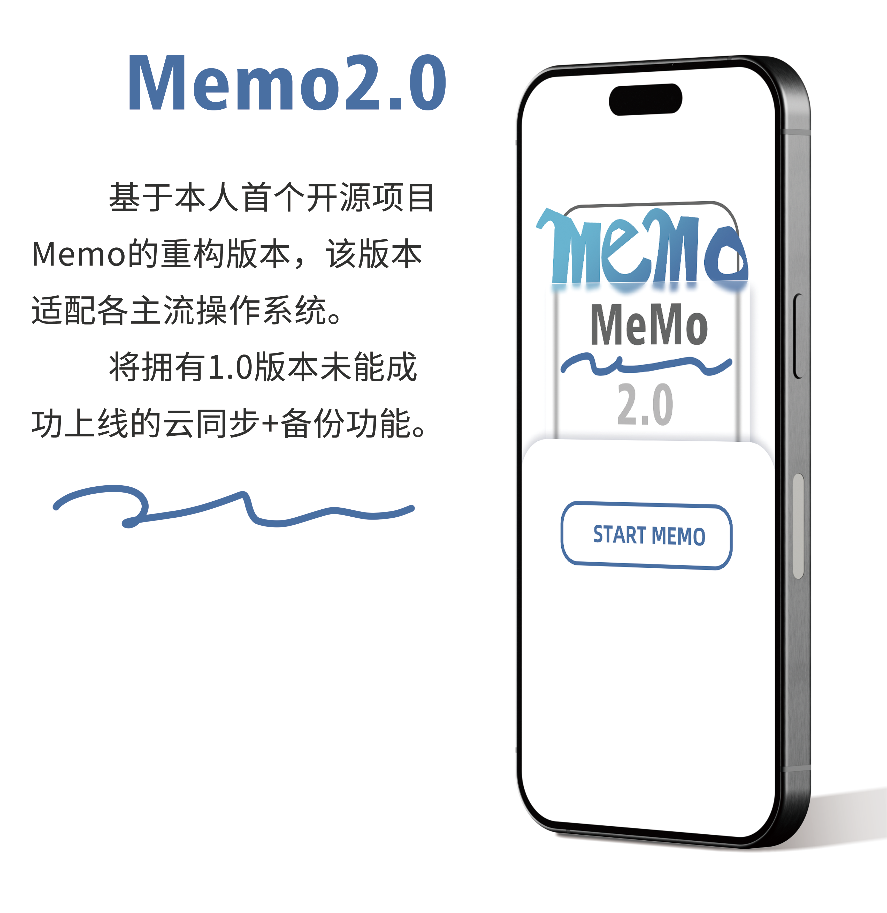

# Memo-2.0 电子日记
<code></code>

语言: [简体中文](https://github.com/Lenc1/Memo-2.0/blob/main/README.md) | [English](https://github.com/Lenc1/Memo-2.0/blob/main/README_EN.md)

基于Memo的重构，适配主流操作系统和移动端

Memo1.0：[Lenc1/Memo](https://github.com/Lenc1/Memo)

介绍视频：[电子日记重构阶段性总结01](https://www.bilibili.com/video/BV1dLPqewEZC/?spm_id_from=333.999.0.0&vd_source=d6cef01511e29291a9a0d6c1df785831)

## 主要功能

- 创建备忘录
- 支持1~3张插入图片
- 支持查看图片、保存图片
- 自定义存储位置
- (待更新...)

## 项目细节

基于Flutter开发的笔记应用

前期使用即时设计绘制UI原型，确定整体设计风格

[Memo2即时设计链接](https://js.design/f/8LEH9N?p=_rjXbN9oGB&linkelement=x95BzVvwrpfqJ6aqpleG3) 

## 许可协议

> 版权所有 (c) 2025 Lenci 
>
> 本项目根据 [MIT](https://opensource.org/license/mit) 协议授权
>
> 请参阅 [LICENSE](https://github.com/Lenc1/Memo-2.0/blob/main/LICENSE) 文件查看完整许可证内容
