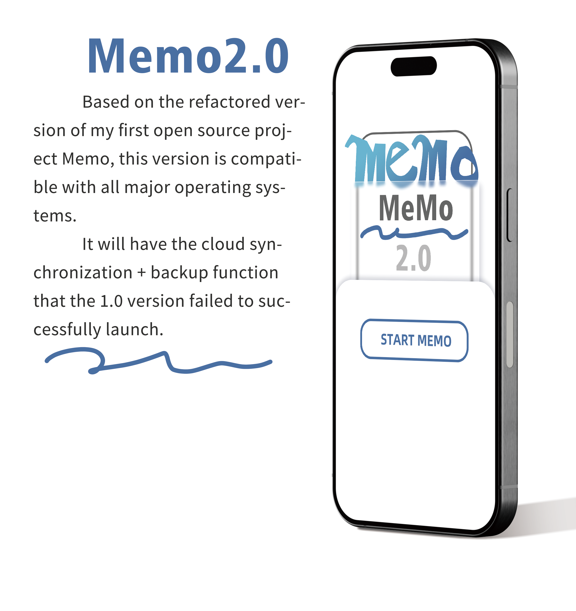
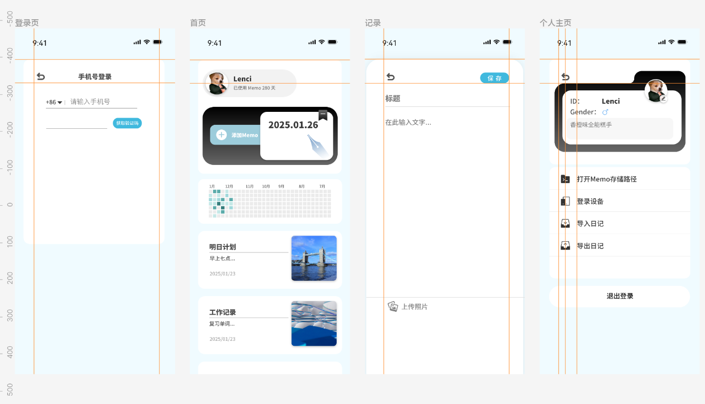

# Memo-2.0
Language: [简体中文](https://github.com/Lenc1/Memo-2.0/blob/main/README.md) | [English](https://github.com/Lenc1/Memo-2.0/blob/main/README_EN.md)

Based on Memo's reconstruction, it adapts to various operating systems and mobile terminals.

Memo1.0：[Lenc1/Memo](https://github.com/Lenc1/Memo)

A note-taking app developed based on Flutter, which supports storing 1 to 3 pictures. In the early stage, use real-time design to draw UI prototypes and determine the overall design style.

[UI design link](https://js.design/f/8LEH9N?p=_rjXbN9oGB&linkelement=x95BzVvwrpfqJ6aqpleG3)

